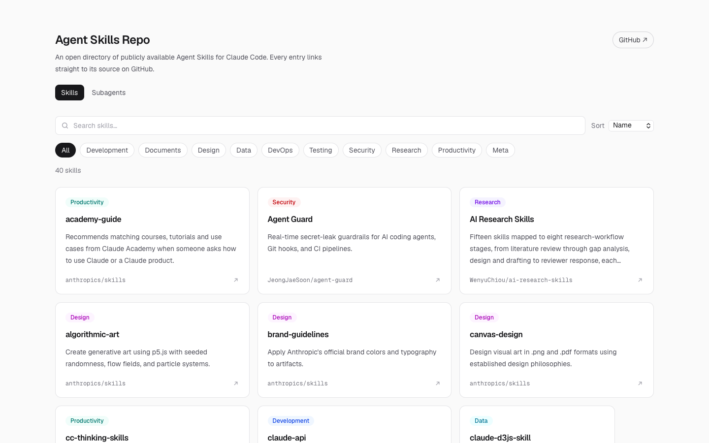
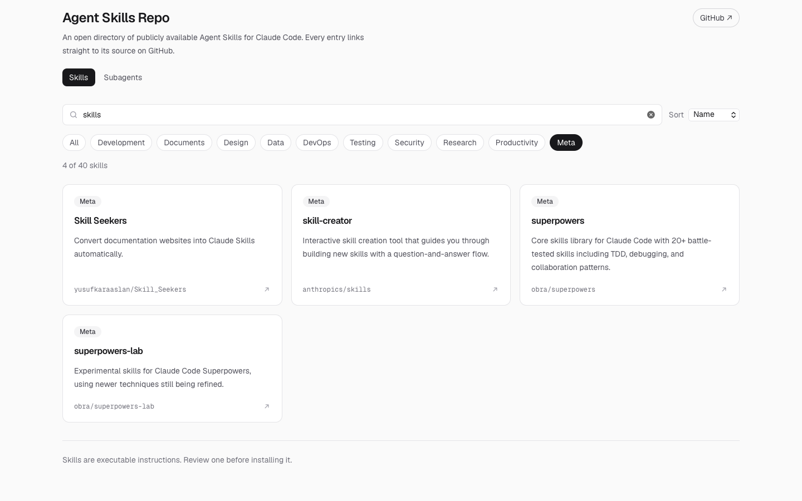
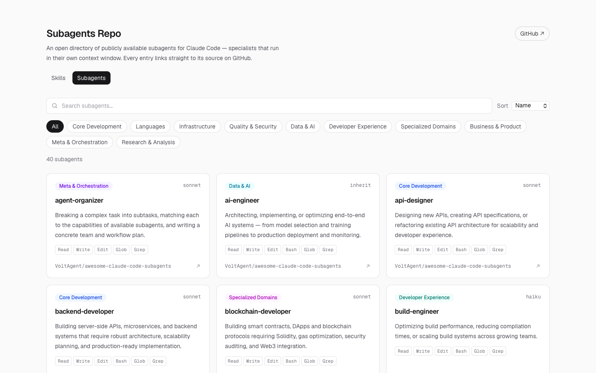
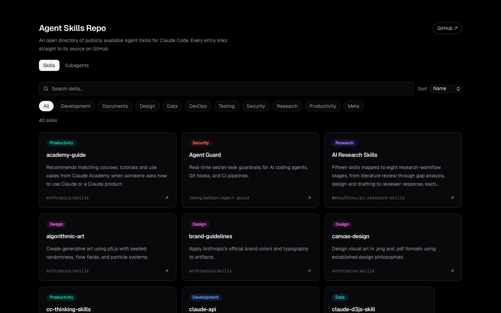
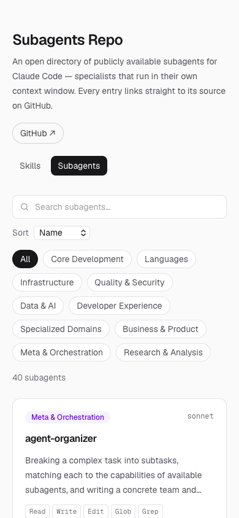

# Claude Code Skills & Subagents Directory

A browsable directory of publicly available **Agent Skills** and **subagents** for
[Claude Code](https://claude.com/claude-code). Search, filter by category, and click any card to open its
source on GitHub.



## Features

- **Two catalogs**: 41 Agent Skills and 40 subagents, each with its own categories, on two tabs
- **Search** across name, description and tags, filtering as you type
- **Category filter** that combines with search, plus sorting by name or category
- **Every card links to its source**, so you can review a skill or subagent before installing it
- **Subagent cards** show the model (`sonnet`, `haiku`, `inherit`…) and the tools the agent may use
- **Light and dark mode**, following your system setting
- **Responsive layout**: 1, 2 or 3 columns depending on screen width
- **Static site**: no backend and no API calls; the data lives in two JSON files

| Search and filter | Subagents |
|---|---|
|  |  |

| Dark mode | Mobile |
|---|---|
|  |  |

## What are skills and subagents?

- **Agent Skill**: a folder with a `SKILL.md` file (Markdown with YAML frontmatter) that gives Claude Code
  expertise in a specific area when it's needed. Installed in `~/.claude/skills/` (personal) or `.claude/skills/` (project).
- **Subagent**: a `.md` file with a system prompt that runs in **its own context window**, as a specialist
  Claude Code can hand work to. Installed in `~/.claude/agents/` (personal) or `.claude/agents/` (project).

Both are instructions an AI agent will follow, so **review one before installing it**.

## Getting started

Requires Node.js 20+.

```bash
npm install
npm run dev          # http://localhost:3000
```

Other commands:

| Command | What it does |
|---|---|
| `npm run build` | Builds the static site into `out/` |
| `npx serve out` | Serves the built site locally |
| `npm run check` | Tests the search/filter logic against both catalogs |
| `npm run lint` | Runs ESLint |

## Adding an entry

Add one object to `data/skills.json` or `data/subagents.json`:

```json
{
  "id": "pdf",
  "name": "pdf",
  "description": "PDF manipulation toolkit for extracting text and tables, creating new PDFs, merging and splitting documents, and handling forms.",
  "category": "documents",
  "url": "https://github.com/anthropics/skills/blob/main/skills/pdf/SKILL.md",
  "tags": ["forms", "extraction", "official"]
}
```

Subagents can also have `"model"` and `"tools"`.

The data is validated at build time, so a bad entry fails `npm run build` with a message pointing at it:

- `id`: lowercase letters, digits and hyphens, unique in its file
- `category`: one of the categories defined in `lib/skills.ts` or `lib/subagents.ts`
- `url`: must start with `https://`
- `name` and `description`: not empty

## Tech stack

Next.js 16 (App Router, static export) · React 19 · TypeScript · Tailwind CSS v4

```
app/            routes: / (skills) and /subagents
components/     shared catalog page, search/filter bar and cards
lib/            data loading, validation and filtering
data/           skills.json and subagents.json
docs/           README screenshots
SPEC.md         product spec
```

## Sources

- [anthropics/skills](https://github.com/anthropics/skills): official skills
- [travisvn/awesome-claude-skills](https://github.com/travisvn/awesome-claude-skills)
- [hesreallyhim/awesome-claude-code](https://github.com/hesreallyhim/awesome-claude-code)
- [VoltAgent/awesome-claude-code-subagents](https://github.com/VoltAgent/awesome-claude-code-subagents)
